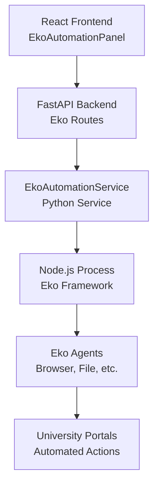

# 🚀 Eko Framework Integration Guide for Elevate Ed

## Overview

This guide explains how to integrate the **Eko Automation Framework** into your Elevate Ed university application platform. Eko is a production-ready JavaScript framework that enables natural language to automation workflows, perfect for university application processes.

## 🎯 What Eko Brings to Elevate Ed

### **Key Capabilities**
- **Natural Language → Workflow**: Convert simple English descriptions into complex automation
- **Multi-Agent Architecture**: Browser, File, Computer, Shell, Timer, and Chat agents
- **Cross-Platform**: Works in Node.js backend and React frontend
- **Human-in-the-Loop**: Intervention capabilities when needed
- **MCP Integration**: Model Context Protocol support for enhanced functionality

### **Perfect for University Applications**
```typescript
// Example: Simple command becomes complex automation
await eko.run(`
  Apply to Oxford University Computer Science:
  1. Navigate to application portal
  2. Fill personal information using client profile
  3. Upload transcripts and personal statement
  4. Submit and save confirmation
`);
```

## 🏗️ Architecture Overview



## 📁 File Structure

```
backend/
├── services/
│   └── eko_automation_service.py     # Python-Node.js bridge
├── routes/
│   └── eko_automation_routes.py      # FastAPI endpoints
└── requirements.txt                  # Add new dependencies

frontend/
├── src/
│   └── components/
│       └── automation/
│           └── EkoAutomationPanel.js # React automation UI
└── package.json                      # Add Eko dependencies
```

## 🔧 Implementation Steps

### **Step 1: Backend Setup**

#### Install Dependencies
```bash
# Backend Python dependencies
pip install asyncio subprocess

# Frontend Node.js dependencies (in services directory)
cd backend/services/eko_scripts
npm install @eko-ai/eko @eko-ai/eko-nodejs
```

#### Environment Variables
```bash
# Add to backend/.env
ANTHROPIC_API_KEY=your_anthropic_key_here
OPENAI_API_KEY=your_openai_key_here  # Optional
```

### **Step 2: API Integration**

The backend provides these key endpoints:

#### Core Endpoints
```python
POST /api/eko/initialize              # Initialize Eko environment
POST /api/eko/workflow/create         # Create custom workflow
POST /api/eko/university/apply        # University application automation
POST /api/eko/applications/monitor    # Monitor application status
POST /api/eko/documents/prepare       # Document preparation
GET  /api/eko/capabilities           # Get framework capabilities
GET  /api/eko/workflows/history      # Workflow history
GET  /api/eko/health                 # Health check
```

#### Example API Usage
```javascript
// Create custom automation workflow
const response = await fetch('/api/eko/workflow/create', {
  method: 'POST',
  headers: {
    'Content-Type': 'application/json',
    'Authorization': `Bearer ${token}`
  },
  body: JSON.stringify({
    task_description: "Apply to 5 UK universities for Computer Science",
    client_data: {
      name: "John Doe",
      email: "john@example.com",
      // ... other profile data
    },
    documents: ["transcript.pdf", "personal_statement.pdf"]
  })
});
```

### **Step 3: Frontend Integration**

#### Main Dashboard Integration
```jsx
// In ModernDashboard.js
import EkoAutomationPanel from '../automation/EkoAutomationPanel';

const quickActions = [
  {
    title: 'Eko Automation',
    description: 'AI-powered workflow automation',
    icon: Brain,
    action: () => setCurrentView('eko-automation')
  }
  // ... other actions
];

// Route to Eko panel
if (currentView === 'eko-automation') {
  return <EkoAutomationPanel onBack={() => setCurrentView('dashboard')} />;
}
```

#### EkoAutomationPanel Features
- **Initialization UI**: Beautiful onboarding for Eko setup
- **Quick Actions**: Pre-built automation templates
- **Agent Management**: View available agents and capabilities
- **Workflow History**: Track automation executions
- **Real-time Status**: Live workflow monitoring

## 🎮 Usage Examples

### **University Application Automation**
```javascript
// Automate Oxford University application
const result = await fetch('/api/eko/university/apply', {
  method: 'POST',
  body: JSON.stringify({
    university_name: "Oxford University",
    application_url: "https://apply.ox.ac.uk",
    client_profile: {
      firstName: "Sarah",
      lastName: "Johnson",
      email: "sarah@example.com",
      program: "Computer Science",
      // ... complete profile
    },
    documents: [
      "transcript.pdf",
      "personal_statement.pdf",
      "recommendation_letter.pdf"
    ]
  })
});
```

### **Multi-Application Monitoring**
```javascript
// Monitor multiple applications
const result = await fetch('/api/eko/applications/monitor', {
  method: 'POST',
  body: JSON.stringify({
    applications: [
      {
        university: "Oxford University",
        portal_url: "https://apply.ox.ac.uk",
        credentials: { /* login info */ }
      },
      {
        university: "Cambridge University", 
        portal_url: "https://apply.cam.ac.uk",
        credentials: { /* login info */ }
      }
    ]
  })
});
```

### **Document Preparation**
```javascript
// Automated document formatting
const result = await fetch('/api/eko/documents/prepare', {
  method: 'POST',
  body: JSON.stringify({
    required_documents: [
      "Academic Transcript",
      "Personal Statement",
      "CV/Resume",
      "Recommendation Letters"
    ],
    client_documents: {
      "Academic Transcript": "/uploads/transcript.pdf",
      "Personal Statement": "/uploads/statement.docx"
    }
  })
});
```

## 🔍 Advanced Features

### **Custom Workflow Creation**
Users can create workflows using natural language:

```javascript
// Natural language workflow
const workflow = await eko.run(`
  Help me apply to 10 UK universities for a Master's in AI:
  
  1. Research top AI programs at UK universities
  2. Check application requirements for each
  3. Fill out applications using my profile data
  4. Upload my documents to each portal
  5. Track application status weekly
  6. Send me updates via email
  
  My profile: Computer Science graduate, 3.8 GPA, 2 years industry experience
  My documents: Available in /uploads/ folder
`);
```

### **Multi-Agent Orchestration**
```javascript
// Multiple agents working together
const agents = [
  new BrowserAgent(),  // Web automation
  new FileAgent(),     // Document management
  new TimerAgent(),    // Scheduling
  new ChatAgent()      // Communication
];

const eko = new Eko({ llms, agents, callback });
```

### **Human-in-the-Loop**
```javascript
// Workflow with intervention points
const workflow = await eko.run(`
  Apply to Cambridge University, but:
  1. Let me review the personal statement before submitting
  2. Ask for confirmation before final submission
  3. Notify me if any errors occur
`);
```

## 📊 Monitoring & Analytics

### **Workflow Metrics**
- **Success Rate**: Track automation success rates
- **Execution Time**: Monitor workflow performance
- **Error Tracking**: Identify and resolve issues
- **Usage Analytics**: Understand user patterns

### **Health Monitoring**
```javascript
// Health check endpoint
GET /api/eko/health

Response:
{
  "service": "Eko Automation",
  "status": "healthy",
  "checks": {
    "node_js": "available",
    "eko_framework": "installed", 
    "browser_agent": "ready",
    "file_agent": "ready"
  }
}
```

## 🔒 Security Considerations

### **API Keys**
- Store API keys securely in environment variables
- **Never expose API keys in frontend code**
- Use backend proxy for all LLM requests

### **Authentication**
- All Eko endpoints require user authentication
- Implement proper authorization for workflow access
- Log all automation activities for audit

### **Data Privacy**
- Client data is processed securely
- No persistent storage of sensitive information
- Compliance with university application privacy requirements

## 🚀 Deployment

### **Development Environment**
```bash
# Backend
cd backend
pip install -r requirements.txt
python server.py

# Frontend  
cd frontend
npm install
npm start
```

### **Production Deployment**
```bash
# Install Node.js on production server
# Set up environment variables
# Deploy with proper process management
```

## 🧪 Testing

### **Unit Tests**
```python
# Test automation service
def test_eko_workflow_creation():
    result = await eko_service.create_automation_workflow(
        task_description="Test university application",
        client_data=test_client_data
    )
    assert result['success'] == True
```

### **Integration Tests**
```javascript
// Test frontend integration
it('should initialize Eko framework', async () => {
  const response = await fetch('/api/eko/initialize');
  expect(response.status).toBe(200);
});
```

## 📚 Resources

### **Eko Framework**
- **Repository**: https://github.com/FellouAI/eko
- **Documentation**: https://eko.fellou.ai/docs
- **Examples**: Reference implementation in `/reference/eko/`

### **Integration Support**
- **Framework Comparison**: Eko vs LangChain vs Browser-use
- **Best Practices**: Natural language prompt engineering
- **Troubleshooting**: Common integration issues

## 🎯 Next Steps

1. **Initialize Eko Environment**: Set up the framework
2. **Test Basic Workflows**: Start with simple automations
3. **Configure University Portals**: Add specific university support
4. **User Training**: Teach clients natural language workflow creation
5. **Monitor & Optimize**: Track performance and improve

## 💡 Benefits for Elevate Ed

### **For Clients**
- **Simplified Process**: Describe what they want in plain English
- **Time Savings**: Automate hours of manual application work
- **Reduced Errors**: AI ensures accuracy and completeness
- **24/7 Availability**: Automation works around the clock

### **For Business**
- **Scalability**: Handle more clients without linear cost increase
- **Competitive Advantage**: Cutting-edge automation technology
- **Higher Success Rates**: More consistent application quality
- **Premium Pricing**: Justify higher fees with advanced automation

### **For Operations**
- **Reduced Manual Work**: Less repetitive data entry
- **Better Resource Utilization**: Focus staff on high-value activities
- **Improved Tracking**: Better visibility into application progress
- **Quality Assurance**: Consistent application processes

---

**Eko Framework integration transforms Elevate Ed from a manual service into an AI-powered automation platform, setting you apart in the competitive university application market.** 